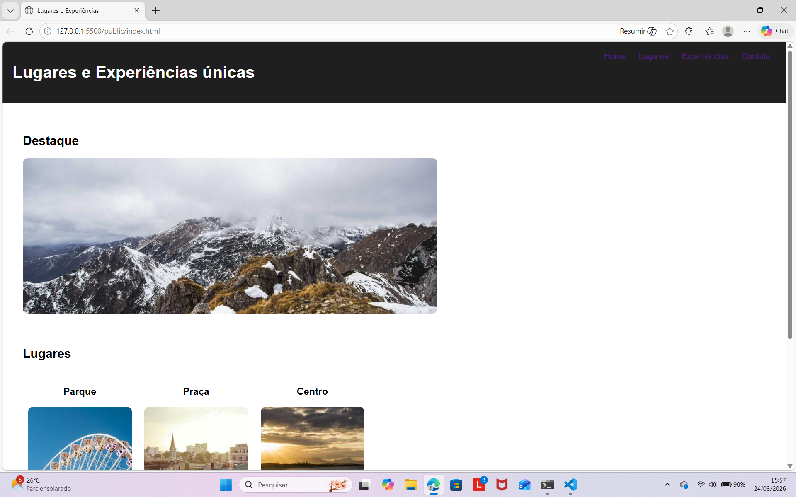

# Trabalho Prático - Semana 04

Desta vez, vamos escolher uma proposta de projeto para trabalhar.

Nesta atividade, você deverá montar a página inicial do projeto escolhido, a organização do HTML aplicando semântica correta e fazer uso aprimorado do CSS. Leia o enunciado completo no Canvas para mais detalhes.

**IMPORTANTE:** Você deve trabalhar e alterar apenas arquivos dentro da pasta **`public`**. Deixe todos os demais arquivos e pastas deste repositório inalterados. **PRESTE MUITA ATENÇÃO NISSO.**

## Informações Gerais

- Nome:Adriano de Jesus Alves
- Matrícula:906517
- Proposta de projeto escolhida:
Lugares e Experiencias Únicas 

.Entidade principal:Lugar(cidades,parques,pontos turísticos)
.Entidade secundária:Experiencias(visitas,passeios,atividades)
- Breve descrição sobre seu projeto:

Este projeto é um site sobre lugares e experiencias únicas,com o objetivo de apresentar pontos turísticos e atividades que podem ser realizadas em diferentes locais.

## Print do(s) wireframe(s) criado(s)
> Sugestão, use o Excalidraw para isso. Utilize este [template básico](https://excalidraw.com/#json=LU-8hwcQEwzk11FwO8Opo,qPU9K6cNUEzlXzwOuKMIlQ) para você começar. 

<<  COLOQUE A IMAGEM AQUI >>

## Print da home-page criada

<<  COLOQUE A IMAGEM AQUI >>

